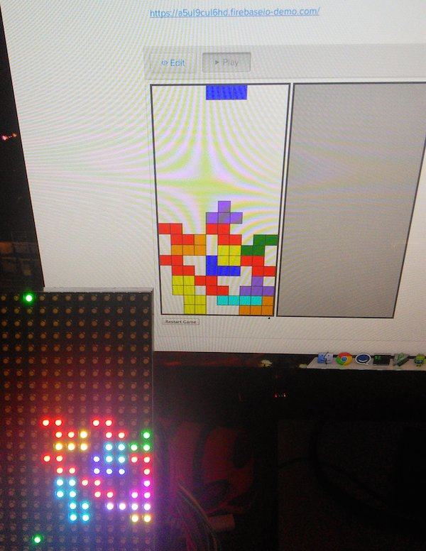

# RGB LED Tetris Viewer

This is quite possibly the hackiest piece of software that I've ever written. But, it works... sort of.

It displays the first player's board state a web Tetris game on a 16x32 LED panel.

## Contents

- `/rpi-rgb-led-matrix` - A hacked-to-bits C++ program, copied from [Boomerific](https://github.com/Boomerific/rpi-rgb-led-matrix). It displays an image on a 16x32 pixel RGB LED panel.
- `/tetris-to-image/ - A node.js program that creates a ppm image based on the board state of the [Firebase tetris example](https://www.firebase.com/tutorial/#example/tetris).

## Using it

0. Wire up an LED RGB 16x32 panel to a Raspberry Pi per the [Adafruit tutorial](https://learn.adafruit.com/connecting-a-16x32-rgb-led-matrix-panel-to-a-raspberry-pi).
0. Start a [Firebase JavaScript exmaple Tetris game](https://www.firebase.com/tutorial/#example/tetris)
0. Copy all of this code to the Raspberry Pi
0. Compile `led-matrix`
        $ cd rpi-rgb-led-matrix && make 
0. Copy `led-matrix` into `tetris-to-image` folder
0. Update the Firebase hard coded in `tetris-to-image` to match the value for your Tetris demo
0. Run the node image maker
        $ node make-ppm-from-tetris.js
0. Run `led-matrix` in a crude bash loop because it will crash constantly because I don't really know C++.
        $ while true ; do sudo ./led-matrix 1 image.ppm ; sleep 1; done
